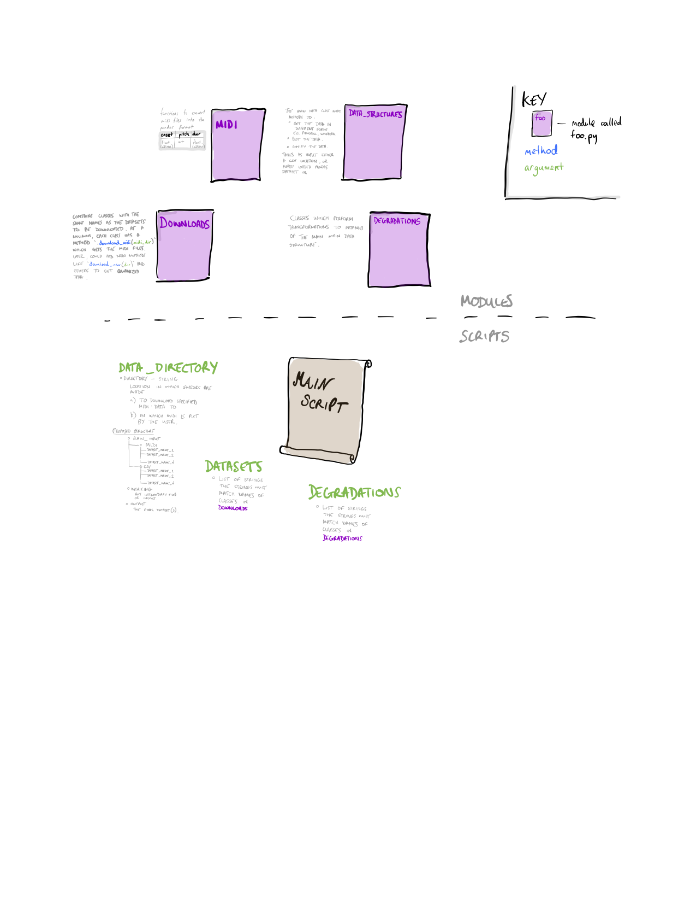

# Description

* `data_structures.py`  - the main data structure class we will transform into
                          and all the functions for converting between
                          different data formats
* `degradations.py`     - code to perform the degradations i.e. edits to the
                          midi data
* `downloaders.py`      - code to download each dataset and convert to the
                          standard format. If you would like to contribute a
                          new dataset, add a new class to this file and simply
                          add the class name to the top level script which
                          generates the dataset
* `midi.py`             - conversion of midi files into other formats
   
For later:
* `pytorch_datasets.py` - classes to use in conjunction with pytorch
                          dataloaders

